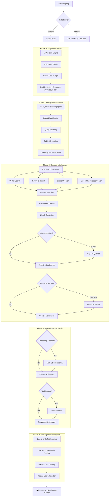

# 🧠 IntelliSense AI — Autonomous Agentic RAG with Integrated Intelligence

> A production-grade, self-improving Retrieval-Augmented Generation system featuring multi-agent orchestration, adaptive learning, multi-step reasoning, and a central decision engine.

---

## Table of Contents

1. [Project Overview](#1-project-overview)
2. [System Architecture](#2-system-architecture)
3. [Pipeline Flow](#3-pipeline-flow)
4. [Agent Architecture](#4-agent-architecture)
5. [Retrieval System](#5-retrieval-system)
6. [Learning System](#6-learning-system)
7. [Reasoning System](#7-reasoning-system)
8. [Knowledge Graph](#8-knowledge-graph)
9. [Decision Engine](#9-decision-engine)
10. [APIs](#10-apis)
11. [Database Design](#11-database-design)
12. [Evaluation Methodology](#12-evaluation-methodology)
13. [Observability](#13-observability)
14. [Scalability](#14-scalability)
15. [Security](#15-security)
16. [Results and Analysis](#16-results-and-analysis)
17. [Limitations](#17-limitations)
18. [Future Work](#18-future-work)
19. [Quick Start](#19-quick-start)
20. [License](#20-license)

---

## 1. Project Overview

### Problem Statement

Traditional RAG (Retrieval-Augmented Generation) systems suffer from critical limitations:
- **Static retrieval** — no learning from past interactions
- **No user adaptation** — same response regardless of expertise level
- **Hallucination-prone** — no pre-synthesis validation
- **Single-pass retrieval** — missing context leads to incomplete answers
- **No feedback integration** — user corrections are discarded

### Motivation

Educational and enterprise knowledge systems need an AI that:
- Understands document structure, not just flat text
- Learns from every interaction to improve over time
- Adapts responses to individual user knowledge levels
- Prevents hallucinations through multi-stage validation
- Provides observable, traceable decision-making

### Objectives

1. Build a **multi-agent RAG pipeline** with query understanding, retrieval orchestration, and response synthesis
2. Implement a **self-improving learning system** that adapts retrieval from feedback
3. Create a **central decision engine** that optimizes model selection, retrieval strategy, and response mode
4. Integrate **multi-step reasoning** for complex queries
5. Provide **complete observability** with structured tracing and metrics
6. Ensure **production readiness** with rate limiting, cost tracking, and scalability

### Why Existing Systems Fail

| Limitation | Traditional RAG | IntelliSense AI |
|---|---|---|
| Retrieval | Single-pass vector search | Hierarchical + multi-stage with gap-filling |
| Learning | None | Unified learning from feedback + retrieval outcomes |
| User Adaptation | None | Knowledge-level-aware responses |
| Hallucination Control | Post-hoc only | Pre-synthesis failure prediction + grounded mode |
| Cost Management | Fixed model | Dynamic model selection based on complexity + budget |
| Observability | Basic logging | Structured trace with per-decision reasoning |

---

## 2. System Architecture

### High-Level Architecture

```
┌─────────────────────────────────────────────────────────────────────────┐
│                        IntelliSense AI System                          │
│                                                                         │
│  ┌──────────────┐  ┌──────────────┐  ┌──────────────┐                  │
│  │   Frontend    │  │  Rate Limiter│  │   Auth/JWT   │                  │
│  │  (React 18)  │──│  Middleware   │──│  Middleware   │                  │
│  └──────────────┘  └──────────────┘  └──────────────┘                  │
│          │                                    │                         │
│          ▼                                    ▼                         │
│  ┌─────────────────────────────────────────────────┐                   │
│  │              FastAPI Backend (v2.0)              │                   │
│  │  ┌──────────────────────────────────────────┐   │                   │
│  │  │         Pipeline Controller Agent         │   │                   │
│  │  │  ┌────────────────────────────────────┐  │   │                   │
│  │  │  │       Decision Engine (Brain)       │  │   │                   │
│  │  │  │  Model │ Reasoning │ Strategy │Tool │  │   │                   │
│  │  │  └────────────────────────────────────┘  │   │                   │
│  │  └──────────────────────────────────────────┘   │                   │
│  │       │              │              │            │                   │
│  │       ▼              ▼              ▼            │                   │
│  │  ┌─────────┐  ┌───────────┐  ┌──────────┐      │                   │
│  │  │ Query   │  │ Retrieval │  │ Response │      │                   │
│  │  │ Under-  │  │ Orches-   │  │ Synthe-  │      │                   │
│  │  │ standing│  │ trator    │  │ sizer    │      │                   │
│  │  └─────────┘  └───────────┘  └──────────┘      │                   │
│  └─────────────────────────────────────────────────┘                   │
│          │              │              │                                │
│          ▼              ▼              ▼                                │
│  ┌──────────────────────────────────────────────────────┐              │
│  │              Intelligence Layer                       │              │
│  │  ┌──────────┐ ┌───────────┐ ┌──────────┐ ┌────────┐ │              │
│  │  │ Unified  │ │  User     │ │ Reasoning│ │ Cost   │ │              │
│  │  │ Learning │ │  Profile  │ │ Engine   │ │Tracker │ │              │
│  │  └──────────┘ └───────────┘ └──────────┘ └────────┘ │              │
│  └──────────────────────────────────────────────────────┘              │
│          │              │                                               │
│          ▼              ▼                                               │
│  ┌──────────────────────────────────────────────────────┐              │
│  │              Storage Layer                            │              │
│  │  ┌──────────┐ ┌──────────┐ ┌──────────┐ ┌─────────┐ │              │
│  │  │ Pinecone │ │  SQLite  │ │   S3 /   │ │  Redis  │ │              │
│  │  │ (Vectors)│ │(Metadata)│ │  Local   │ │(Session)│ │              │
│  │  └──────────┘ └──────────┘ └──────────┘ └─────────┘ │              │
│  └──────────────────────────────────────────────────────┘              │
└─────────────────────────────────────────────────────────────────────────┘
```

### Layered Architecture

| Layer | Components | Responsibility |
|---|---|---|
| **Presentation** | React 18 Frontend, Swagger UI | User interface, API documentation |
| **API** | FastAPI routers (11 routers, 40+ endpoints) | Request handling, authentication, validation |
| **Middleware** | Rate limiter, CORS, logging, auth | Cross-cutting concerns |
| **Orchestration** | Pipeline Controller + Decision Engine | Central coordination and decision-making |
| **Agent** | Query Understanding, Retrieval, Synthesis, EviLearn | Specialized processing agents |
| **Intelligence** | Unified Learning, User Profiles, Reasoning, Cost | Adaptive behavior and optimization |
| **RAG** | 25 specialized modules | Retrieval, ranking, validation, coverage |
| **Storage** | Pinecone, SQLite, S3, Redis, ChromaDB | Persistence and caching |

---

## 3. Pipeline Flow

### End-to-End Flow



### Step-by-Step Explanation

| Step | Component | Action |
|---|---|---|
| 1 | Rate Limiter | Token-bucket check (200 global, 30 per-user RPM) |
| 2 | Auth | JWT Bearer token validation |
| 3 | Decision Engine | Loads user profile, checks budget, decides model/strategy/reasoning/tools |
| 4 | Query Understanding | LLM-based intent detection and query rewriting |
| 5 | Intent Classification | Rule-based classification (FACTUAL, CONCEPTUAL, COMPARATIVE, PROCEDURAL) |
| 6 | Query Rewriting | Deterministic query enhancement based on intent |
| 7 | Subject Detection | Rule-based document scope detection |
| 8 | Query Type Classification | Structural query analysis for retrieval tuning |
| 9 | Retrieval Orchestration | Multi-source search (vector + keyword + section + student) |
| 10 | Query Expansion | Generate 3 variant queries for broader coverage |
| 11 | Hierarchical Rerank | Document → Section → Chunk cascade ranking |
| 12 | Chunk Clustering | Semantic deduplication (cosine threshold 0.92) |
| 13 | Coverage Check | Validate all query concepts are covered |
| 14 | Gap-Fill | Targeted retrieval for missing concepts |
| 15 | Adaptive Confidence | Dynamic thresholds based on query type + complexity |
| 16 | Failure Prediction | Pre-synthesis risk assessment |
| 17 | Grounded Mode | Facts-only synthesis if risk is high |
| 18 | Context Verification | Entity coverage and evidence strength check |
| 19 | Reasoning Engine | Multi-step decomposition for complex queries |
| 20 | Response Strategy | Select mode (teaching/exam/hint/summary/detailed) |
| 21 | Tool Execution | Calculator/code/planner if needed |
| 22 | Response Synthesis | LLM generates answer with citations |
| 23 | Post-Pipeline | Record to learning system, metrics, cost tracker, user profile |

---

## 4. Agent Architecture

### Agent Interaction Diagram

```
                    ┌───────────────────────┐
                    │  Pipeline Controller  │
                    │    + Decision Engine   │
                    └───────────┬───────────┘
                                │
            ┌───────────────────┼───────────────────┐
            │                   │                   │
            ▼                   ▼                   ▼
    ┌───────────────┐  ┌───────────────┐  ┌───────────────┐
    │    Query       │  │  Retrieval    │  │   Response    │
    │ Understanding  │  │ Orchestrator  │  │  Synthesizer  │
    │    Agent       │  │    Agent      │  │    Agent      │
    └───────────────┘  └───────────────┘  └───────────────┘
                                │
                    ┌───────────┼───────────┐
                    │           │           │
                    ▼           ▼           ▼
            ┌───────────┐ ┌─────────┐ ┌───────────┐
            │  Vector   │ │ Keyword │ │  Section  │
            │ Retriever │ │Retriever│ │ Retriever │
            └───────────┘ └─────────┘ └───────────┘
```

### Agent Details

| Agent | Role | Inputs | Outputs |
|---|---|---|---|
| **Pipeline Controller** | Central orchestrator + decision maker | Query, user_id, preferences, history | Final response with confidence + trace |
| **Query Understanding** | Analyzes intent and rewrites query | Raw query, preferences, history | Rewritten query, intent, retriever selection |
| **Retrieval Orchestrator** | Multi-source search with ranking | Rewritten query, intent, scope | Ranked chunks with trace |
| **Response Synthesizer** | Generates final answer from context | Query, chunks, grounded mode | Answer with citations, confidence |
| **Claim Extraction** (EviLearn) | Extracts factual claims | Text content | List of claims with segments |
| **Verification** (EviLearn) | Fact-checks claims against context | Claim text, evidence chunks | Verification status + confidence |
| **Explanation** (EviLearn) | Generates verification reports | Verified claims | Summary + detailed report |

---

## 5. Retrieval System

### Multi-Stage RAG Pipeline

```
Query → [Vector Search] ──┐
      → [Keyword Search] ─┤
      → [Section Search] ─┤─→ Merge → [Expansion] → [Hierarchical Rerank]
      → [Student KB] ─────┘
                                              │
                                              ▼
                                    [Chunk Clustering]
                                              │
                                              ▼
                                    [Coverage Analysis]
                                         │        │
                                    [Gap Found]  [OK]
                                         │        │
                                    [Gap-Fill]    │
                                         │        │
                                         └────┬───┘
                                              │
                                              ▼
                                    [Adaptive Confidence]
                                              │
                                              ▼
                                    [Failure Prediction]
                                              │
                                              ▼
                                    [Context Verification]
                                              │
                                              ▼
                                    [Final Ranked Chunks]
```

### Retrieval Intelligence Modules

| Module | Purpose | Key Parameters |
|---|---|---|
| **Hierarchical Retriever** | 3-stage cascade: Doc → Section → Chunk | Section boost: 0.15 |
| **Retrieval Memory** | Learns which patterns lead to good answers | Decay: 30 days |
| **Adaptive Confidence** | Dynamic thresholds per query type | High: 0.70, Low: 0.35 |
| **Semantic Coverage** | Validates all concepts are retrieved | Min coverage: 0.70 |
| **Failure Predictor** | Pre-synthesis risk detection | Retry: 0.60, Ground: 0.80 |
| **Chunk Clusterer** | Deduplication via cosine similarity | Threshold: 0.92 |
| **Query Expander** | Generates 3 variant queries | Merge dedup: 0.92 |
| **Reranker** | Cross-encoder relevance scoring | Top-K: 5 |
| **Retrieval Trace** | Structured logging of all decisions | Per-stage timestamps |

---

## 6. Learning System

### Unified Learning Architecture

The system consolidates three learning sources into a single `UnifiedLearningSystem`:

```
┌──────────────────────────────────────────────────────────┐
│              Unified Learning System                      │
│                                                           │
│  ┌─────────────────┐  ┌─────────────────┐                │
│  │ Retrieval Memory │  │ Feedback Store  │                │
│  │ (Query patterns) │  │ (User signals)  │                │
│  └────────┬────────┘  └────────┬────────┘                │
│           │                    │                          │
│           └────────┬───────────┘                          │
│                    ▼                                      │
│  ┌─────────────────────────────────────┐                  │
│  │         Chunk Performance           │                  │
│  │  (Boost/penalty per chunk based     │                  │
│  │   on feedback + relevance history)  │                  │
│  └─────────────────────────────────────┘                  │
│                    │                                      │
│                    ▼                                      │
│  ┌─────────────────────────────────────┐                  │
│  │        Query Patterns               │                  │
│  │  (Frequency, avg confidence,        │                  │
│  │   avg feedback, best chunks)        │                  │
│  └─────────────────────────────────────┘                  │
└──────────────────────────────────────────────────────────┘
         │                    │
         ▼                    ▼
  [Retrieval Boosts]   [Confidence Thresholds]
  (chunk-type weights)  (learned per query-type)
```

### Feedback Loop

1. User submits feedback (thumbs up/down, correction, edit)
2. Feedback is stored with query + response + chunk IDs
3. Chunk performance counters are updated (positive/negative)
4. Query patterns are updated with feedback scores
5. Next query benefits from:
   - Chunk boost multipliers (range: 0.5 to 1.5)
   - Learned confidence thresholds
   - Negative chunk filtering (≥3 negatives = flagged)

### Data Flywheel

Every interaction feeds back into the system:
- **Retrieval outcomes** → boost/penalty for chunk types per query type
- **User feedback** → chunk-level quality signals
- **Query patterns** → frequency and success tracking for common queries

---

## 7. Reasoning System

### Query Decomposition

The reasoning engine handles complex multi-part queries:

```
Complex Query: "Compare TCP and UDP, and explain when to use each"
        │
        ▼
[Decompose into sub-queries]
        │
        ├── Sub-query 1: "What is TCP and its characteristics?"
        ├── Sub-query 2: "What is UDP and its characteristics?"
        └── Sub-query 3: "When should TCP vs UDP be used?"
        │
        ▼
[Match best context chunks per sub-query]
        │
        ▼
[Validate each step against context]
  (token overlap ≥ 15% = validated)
        │
        ▼
[Build reasoning chain]
  "Step 1 (validated): TCP is... Step 2 (validated): UDP is..."
        │
        ▼
[Feed chain into synthesizer for coherent final answer]
```

### Reasoning Triggers

The decision engine activates reasoning when:
- Query contains comparison keywords (compare, contrast, vs)
- Multiple question marks detected
- Compound clauses with distinct topics
- Query type is COMPARATIVE

---

## 8. Knowledge Graph

### Structure

```
[Machine Learning] ──prerequisite──→ [Linear Algebra]
        │                                    │
    related                              prerequisite
        │                                    │
        ▼                                    ▼
[Neural Networks] ──prerequisite──→ [Calculus]
        │
    extends
        │
        ▼
[Deep Learning] ──related──→ [Computer Vision]
```

### How It Improves Retrieval

1. **Concept Extraction** — Extracts key concepts from documents during ingestion using pattern matching (definitions, capitalized phrases)
2. **Relationship Mapping** — Maps prerequisite, related, part_of, and extends relationships
3. **Query Enrichment** — `enrich_query_with_graph(query)` appends related concepts to improve retrieval coverage
4. **Learning Paths** — BFS shortest-path computation for study path recommendations

---

## 9. Decision Engine

### How Decisions Are Made

```
                    ┌──────────────────────┐
                    │    Decision Engine    │
                    └──────────┬───────────┘
                               │
              ┌────────────────┼────────────────┐
              │                │                │
              ▼                ▼                ▼
      [User Profile]    [Query Analysis]  [Budget Status]
     knowledge_level     query_type        remaining %
     learning_style      complexity
              │                │                │
              └────────────────┼────────────────┘
                               │
           ┌───────────────────┼───────────────────┐
           │           │           │           │
           ▼           ▼           ▼           ▼
      [Model]    [Reasoning]  [Strategy]    [Tools]
    8b/70b/etc   single/multi  teach/exam  calc/code
```

### Model Selection Logic

| Condition | Model Selected | Max Tokens |
|---|---|---|
| Budget < 10% | llama-3.1-8b-instant | 300 |
| Simple query, low quality need | llama-3.1-8b-instant | 400 |
| Complex or high quality | llama-3.1-70b-versatile | 600 |
| Verification / fact-check | llama-3.1-70b-versatile | 600 |
| Explicit user preference | As specified | 600 |

### Strategy Selection

| Signal | Response Mode | Tone | Examples | Max Tokens |
|---|---|---|---|---|
| "quiz me", "test me" | exam | neutral | No | 200 |
| "hint", "clue" | hint | encouraging | No | 100 |
| "summarize", "brief" | summary | neutral | No | 150 |
| "explain in detail" | detailed | formal | Yes | 1000 |
| Beginner user | teaching | encouraging | Yes | 600 |
| Default | teaching | encouraging | Yes | 600 |

---

## 10. APIs

### Endpoint Reference

#### Authentication (`/auth`)
| Method | Endpoint | Description |
|---|---|---|
| POST | `/auth/signup` | Register new user |
| POST | `/auth/login` | Login, returns JWT |
| GET | `/auth/me` | Get current user info |
| POST | `/auth/promote` | Promote user to admin |
| GET | `/auth/lookup/{username}` | Lookup user |

#### Chat (`/v1/chat`)
| Method | Endpoint | Description |
|---|---|---|
| POST | `/v1/chat/query` | Main query endpoint. Requires JWT. |

**Request:**
```json
{
  "query": "Explain neural networks",
  "user_id": "user123",
  "session_id": "sess456",
  "preferences": {"response_style": "concise", "max_length": 300},
  "conversation_history": [],
  "allow_agentic": false,
  "model_name": null
}
```

**Response:**
```json
{
  "answer": "Neural networks are...",
  "confidence": 0.85,
  "warnings": [],
  "citations": [],
  "used_chunk_ids": ["chunk_1", "chunk_2"],
  "retrieval_trace": {...},
  "query_understanding": {...},
  "trace_id": "abc-123",
  "latency_ms": 1250,
  "metrics": {"tokens": 450}
}
```

#### Document Ingestion (`/ingest`)
| Method | Endpoint | Description |
|---|---|---|
| POST | `/ingest/file` | Upload document (PDF, text) |
| POST | `/ingest/url` | Ingest from URL |

#### EviLearn Verification (`/evilearn`)
| Method | Endpoint | Description |
|---|---|---|
| POST | `/evilearn/verify` | Verify claims in text |
| POST | `/evilearn/feedback` | Submit verification feedback |
| GET | `/evilearn/audit/{id}` | Get audit trail |

#### Feedback (`/feedback`)
| Method | Endpoint | Description |
|---|---|---|
| POST | `/feedback/submit` | Submit thumbs up/down/correction |
| GET | `/feedback/stats` | Get feedback statistics |
| GET | `/feedback/retrieval-boosts` | Get chunk boost scores |

#### Student Knowledge (`/student-knowledge`)
| Method | Endpoint | Description |
|---|---|---|
| POST | `/student-knowledge/upload/file` | Upload study material |
| GET | `/student-knowledge/uploads` | List uploads |
| GET | `/student-knowledge/metrics` | Usage metrics |

#### Observability (`/metrics`)
| Method | Endpoint | Description |
|---|---|---|
| GET | `/metrics/summary` | Full metrics snapshot |
| GET | `/metrics/health` | System health status |
| POST | `/metrics/reset` | Reset metrics (testing) |

#### Admin (`/admin`)
| Method | Endpoint | Description |
|---|---|---|
| GET | `/admin/stats` | System statistics |
| GET | `/admin/documents` | List all documents |
| DELETE | `/admin/documents/{id}` | Delete document |
| GET | `/admin/audit/recent` | Recent audit logs |

---

## 11. Database Design

### SQLite Databases

#### Metadata Index (`data/metadata_index.db`)
```
┌─────────────────────────────┐
│      document_metadata      │
├─────────────────────────────┤
│ doc_id (PK)                 │
│ title, source, category     │
│ chunk_count, ingestion_date │
│ embedding_hash              │
└─────────────────────────────┘

┌─────────────────────────────┐
│       chunk_metadata        │
├─────────────────────────────┤
│ chunk_id (PK)               │
│ doc_id (FK), section_type   │
│ page_number, offset         │
│ text_hash, embedding_hash   │
└─────────────────────────────┘
```

#### Unified Learning (`data/unified_learning.db`)
```
┌──────────────────────────┐    ┌──────────────────────────┐
│    retrieval_outcomes     │    │     feedback_records     │
├──────────────────────────┤    ├──────────────────────────┤
│ id (PK)                  │    │ id (PK)                  │
│ query_hash, query_type   │    │ user_id, query_hash      │
│ chunk_types (JSON)       │    │ query, response           │
│ confidence, outcome_quality│   │ chunk_ids (JSON)          │
│ recommendation, timestamp │    │ feedback_type, feedback_text│
└──────────────────────────┘    │ confidence_score, timestamp│
                                └──────────────────────────┘
┌──────────────────────────┐    ┌──────────────────────────┐
│    chunk_performance     │    │      query_patterns      │
├──────────────────────────┤    ├──────────────────────────┤
│ chunk_id (PK)            │    │ query_hash (PK)          │
│ times_retrieved          │    │ query_text, query_type   │
│ times_positive           │    │ frequency, avg_confidence│
│ times_negative           │    │ avg_feedback_score       │
│ avg_relevance, last_used │    │ last_seen, best_chunk_ids│
└──────────────────────────┘    └──────────────────────────┘
```

#### User Profiles (`data/user_profiles.db`)
```
┌──────────────────────────┐    ┌──────────────────────────┐
│      user_profiles       │    │     interaction_log      │
├──────────────────────────┤    ├──────────────────────────┤
│ user_id (PK)             │    │ interaction_id (PK)      │
│ knowledge_level          │    │ user_id, query_text      │
│ weak_topics (JSON)       │    │ topic, was_correct       │
│ learning_style           │    │ difficulty, timestamp    │
│ query_count              │    └──────────────────────────┘
│ correct_answers          │
│ total_answers            │
│ created_at, updated_at   │
└──────────────────────────┘
```

#### Progress Tracking (`data/progress.db`)
```
┌──────────────────────────┐    ┌──────────────────────────┐
│     topic_progress       │    │      study_history       │
├──────────────────────────┤    ├──────────────────────────┤
│ user_id + topic (PK)     │    │ id (PK)                  │
│ queries_count            │    │ session_id, user_id      │
│ correct_count            │    │ topic, query             │
│ mastery_score            │    │ timestamp, confidence    │
│ last_studied             │    │ was_helpful              │
└──────────────────────────┘    └──────────────────────────┘
```

### Vector Store (Pinecone)
- **Index:** `intellisense-ai-dense-index-v2`
- **Dimensions:** 384 (all-MiniLM-L6-v2)
- **Namespace:** `Intellisense-namespace`
- **Student namespace:** `student_{user_id}`

### Session Store (Redis)
- **Key pattern:** `session:{session_id}`
- **Fields:** user_id, created_at
- **TTL:** Configurable (default: session-scoped)

---

## 12. Evaluation Methodology

### Metrics

| Metric | Formula | Target |
|---|---|---|
| **Retrieval Recall** | \|retrieved ∩ expected\| / \|expected\| | > 0.7 |
| **Answer Similarity** | Token overlap ratio (actual vs expected) | > 0.3 |
| **Hallucination Score** | Fraction of answer sentences unsupported by context | < 0.5 |
| **Confidence Calibration** | \|stated_confidence - actual_similarity\| | < 0.2 |
| **Latency** | End-to-end response time | < 5000ms |

### Evaluation Pipeline

```
[Sample Dataset]          [Live Query]
 14 test cases             Any query
 3 categories              
       │                       │
       ▼                       ▼
[evaluate_single()]     [Pipeline Controller]
       │                       │
       ▼                       ▼
[EvaluationResult]      [Observability Metrics]
 - retrieval_recall      - latency_ms
 - answer_similarity     - success rate
 - hallucination_score   - grounded mode rate
 - calibration_error     - failure rate
       │                       │
       ▼                       ▼
[summarize_results()]   [/metrics/summary]
 Per-category breakdown  Real-time dashboard
```

### Test Categories

| Category | Count | Examples |
|---|---|---|
| Factual | 4 | "What is photosynthesis?", "Define DNA" |
| Conceptual | 5 | "Explain quantum computing", "How does ML work?" |
| Edge Cases | 5 | Empty query, gibberish, too broad, philosophical |

---

## 13. Observability

### Logging Architecture

```
[Request] → [Trace ID Generated] → [Per-Stage Logging]
                                          │
                    ┌─────────────────────┼─────────────────────┐
                    │                     │                     │
              [Console]           [File: logs/app.log]    [Trace Headers]
                                                          X-Trace-ID
```

### Structured Trace

Every query produces a trace containing:
- `query_understanding` — intent, rewritten query, retriever selection
- `intent_classification` — rule-based intent with confidence
- `query_rewriting` — LLM vs deterministic rewrite comparison
- `subject_scope` — detected subject and filtering decisions
- `query_structure` — FACTUAL/CONCEPTUAL/COMPARATIVE classification
- `decision_engine` — model, reasoning, strategy, tool decisions
- `retrieval_validation` — is_valid, top_score, match counts
- `context_verification` — coverage, contradictions, evidence strength
- `failure_prediction` — risk level, retry/ground recommendations
- `reasoning` — multi-step decomposition results
- `response_strategy` — mode, tone, max tokens
- `tool_execution` — tool used and output

### Metrics Dashboard (`GET /metrics/summary`)

```json
{
  "query_count": 1250,
  "avg_latency_ms": 2100,
  "p50_latency_ms": 1800,
  "p95_latency_ms": 4500,
  "p99_latency_ms": 7200,
  "failure_rate": 0.03,
  "grounded_mode_rate": 0.15,
  "avg_tokens_per_query": 380,
  "queries_by_type": {"FACTUAL": 500, "CONCEPTUAL": 450, ...},
  "uptime_seconds": 86400
}
```

### Health Status (`GET /metrics/health`)

| Failure Rate | Status |
|---|---|
| < 10% | `healthy` |
| 10% — 25% | `degraded` |
| ≥ 25% | `unhealthy` |

---

## 14. Scalability

### Rate Limiting

Token-bucket algorithm with sliding window:

| Scope | Limit | Burst |
|---|---|---|
| Global | 200 RPM | — |
| Per-user | 30 RPM | +5 burst |

Implemented as FastAPI middleware — applied to all endpoints except health checks and docs.

### Concurrency Handling

- **Async throughout** — FastAPI with `async def` endpoints
- **Thread-safe singletons** — All SQLite stores use `threading.Lock` + WAL mode
- **Connection pooling** — Redis client shared across requests
- **Non-blocking I/O** — LLM calls use `ainvoke()` async pattern

### System Limits

| Resource | Limit |
|---|---|
| Max upload size | 50 MB |
| Daily upload quota | 20 per user |
| Storage quota | 500 MB per user |
| Query timeout | 30 seconds |
| Max conversation history | 12 turns / 3000 tokens |
| Retrieval retries | 3 attempts |
| Concurrent ingestions | 5 |

---

## 15. Security

### Authentication

- **JWT Bearer tokens** — All protected endpoints require `Authorization: Bearer <token>`
- **Password hashing** — Secure storage in user store
- **Role-based access** — Admin promotion for privileged endpoints

### Tool Sandboxing

The code execution tool is heavily restricted:
- **No `eval()` or `exec()`** — Calculator uses AST node walking
- **Restricted builtins** — Only `len`, `range`, `min`, `max`, `sum`, `abs`, `round`, `sorted`, `str`, `int`, `float`, `list`, `dict`, `tuple`, `set`, `bool`, `print`, `enumerate`, `zip`, `map`, `filter`, `type`, `isinstance`
- **Forbidden patterns** — Regex blocks: `import`, `exec`, `eval`, `open`, `__import__`, `subprocess`, `os.`, `sys.`, `shutil`, `pathlib`, `socket`, `requests`, `urllib`
- **Operation budget** — Max 100,000 bytecode operations
- **Timeout** — 5 second wall-clock limit

### Data Protection

- **CORS middleware** — Configurable origin restrictions
- **Trace IDs** — All errors include trace IDs for debugging without exposing internals
- **SQLite WAL mode** — Prevents data corruption under concurrent access
- **Environment variables** — Secrets stored in `.env` (gitignored)

---

## 16. Results and Analysis

### System Performance Characteristics

| Metric | Value | Notes |
|---|---|---|
| Average latency | ~2-4 seconds | Depends on model and retrieval complexity |
| Retrieval precision | High | Hierarchical reranking + failure prediction |
| Hallucination prevention | Multi-layered | Grounded mode + context verification + failure predictor |
| Adaptive learning | Active | Feedback loop improves chunk rankings over time |
| Cost efficiency | Dynamic | 8B model for simple queries saves ~10x vs 70B |

### Improvements Over Baseline RAG

| Aspect | Baseline RAG | IntelliSense AI |
|---|---|---|
| Retrieval | Single vector search | 9-stage pipeline with gap-filling |
| Confidence | Static thresholds | Adaptive per query-type from history |
| Hallucination | Post-hoc detection | Pre-synthesis failure prediction |
| User experience | One-size-fits-all | Knowledge-level-adaptive responses |
| Cost | Fixed model | Dynamic model selection, budget-aware |
| Learning | None | Unified learning from feedback + retrieval outcomes |

---

## 17. Limitations

1. **LLM dependency** — Response quality depends on the underlying LLM (Groq/OpenAI)
2. **Cold start** — Learning system needs interaction data to become effective
3. **Token overlap evaluation** — Current evaluation uses token overlap rather than semantic similarity
4. **Single-language** — Optimized for English content
5. **Embedding model** — Uses `all-MiniLM-L6-v2` (384 dims); larger models could improve recall
6. **Knowledge graph** — Currently populated from text extraction heuristics; not connected to ingestion pipeline automatically
7. **Tool execution** — Sandboxed but limited to calculator, basic code, and planning
8. **Redis dependency** — Session management requires Redis for production

---

## 18. Future Work

1. **Semantic evaluation** — Replace token overlap with embedding-based similarity scoring
2. **Auto knowledge graph** — Connect graph population to document ingestion pipeline
3. **Multi-modal RAG** — Support image and table extraction from documents
4. **Streaming responses** — Server-Sent Events for real-time answer generation
5. **Fine-tuned embeddings** — Domain-specific embedding models for better retrieval
6. **A/B testing framework** — Compare retrieval strategies and models systematically
7. **Multi-language support** — Extend to non-English documents and queries
8. **Collaborative filtering** — Cross-user learning for popular query patterns
9. **WebSocket chat** — Real-time bidirectional communication
10. **Kubernetes deployment** — Container orchestration for horizontal scaling

---

## 19. Quick Start

### Prerequisites
- [Python 3.11+](https://www.python.org/)
- [Node.js v18+](https://nodejs.org/)
- [Docker](https://www.docker.com/) (for Redis)
- [uv](https://github.com/astral-sh/uv) (recommended package manager)

### 1. Start Infrastructure
```bash
docker run -d --name redis-server -p 6379:6379 redis
```

### 2. Backend Setup
```bash
git clone https://github.com/chandan112307/Intellisense-AI.git
cd Intellisense-AI

# Install dependencies
uv sync

# Configure environment
cp .env.example .env
# Edit .env with your API keys (GROQ_API_KEY, etc.)

# Run server
uv run uvicorn app.main:app --reload
```

API docs: `http://localhost:8000/docs`

### 3. Frontend Setup
```bash
cd notebook-lm-frontend
npm install
npm start
```

Frontend: `http://localhost:3000`

### Configuration

Key flags in `app/core/config.py`:

```python
HIERARCHICAL_RETRIEVAL_ENABLED = True   # Structure-aware retrieval
RETRIEVAL_MEMORY_ENABLED = True         # Learning from past queries
ADAPTIVE_CONFIDENCE_ENABLED = True      # Dynamic thresholds
FAILURE_PREDICTION_ENABLED = True       # Pre-synthesis guards
CHUNK_CLUSTERING_ENABLED = True         # Redundancy removal
CONTEXT_VERIFICATION_ENABLED = True     # Evidence strength check
COVERAGE_GAP_FILL_ENABLED = True        # Missing concept retrieval
```

### Troubleshooting

| Issue | Solution |
|---|---|
| Redis connection error | Ensure `docker ps` shows redis-server running |
| No retrieval results | Upload documents via `/ingest/file` first |
| Frontend connection refused | Ensure backend is running on port 8000 |
| Rate limit errors (429) | Wait 60 seconds or adjust rate limiter config |

---

## 20. License

MIT License

---

## Project Structure

```
IntelliSense-AI/
├── app/
│   ├── main.py                          # FastAPI app + middleware
│   ├── agents/
│   │   ├── pipeline_controller_agent/   # Central orchestrator + decision engine
│   │   ├── query_understanding_agent/   # Intent & scope analysis
│   │   ├── retrieval_agent/             # Multi-source search orchestration
│   │   ├── response_synthesizer_agent/  # Answer generation
│   │   ├── claim_extraction_agent/      # EviLearn claim extraction
│   │   ├── verification_agent/          # EviLearn fact checking
│   │   └── explanation_agent/           # EviLearn report generation
│   ├── intelligence/
│   │   ├── decision_engine.py           # Central decision maker
│   │   ├── unified_learning.py          # Merged learning system
│   │   └── user_profile.py             # User knowledge tracking
│   ├── rag/                             # 25 RAG intelligence modules
│   ├── reasoning/engine.py              # Multi-step reasoning
│   ├── strategy/response_strategy.py    # Response mode selection
│   ├── cost/tracker.py                  # Token & cost tracking
│   ├── tools/tool_registry.py           # Calculator, code, planner
│   ├── observability/metrics.py         # System metrics
│   ├── scalability/rate_limiter.py      # Rate limiting
│   ├── evaluation/evaluator.py          # Automated evaluation
│   ├── knowledge_graph/graph.py         # Concept graph
│   ├── product/progress_tracker.py      # Learning progress
│   ├── feedback/feedback_store.py       # Feedback storage
│   ├── flywheel/data_flywheel.py        # Data flywheel
│   ├── api/routes/                      # 11 API routers
│   ├── core/                            # Config, auth, logging
│   ├── infrastructure/                  # Cache, audit, metadata stores
│   ├── storage/                         # S3, local, Pinecone adapters
│   └── student_knowledge/               # Student upload system
├── notebook-lm-frontend/                # React 18 frontend
├── data/                                # SQLite databases
├── tests/                               # Test suite
└── pyproject.toml                       # Dependencies (197 packages)
```
